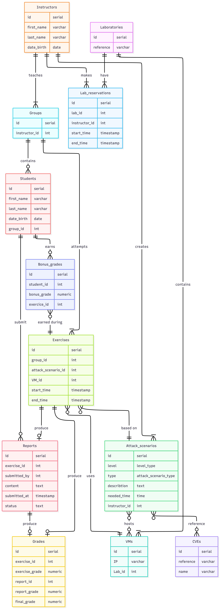

# Design Document

By Youssef Harchay

# Scope

The purpose of this database is to manage a cybersecurity laboratory platform used in educational institutions. It allows instructors to create attack scenarios, assign practical exercises to student groups, evaluate their work, and monitor their performance throughout the course.

The database represents the following entities:

- Instructors
- Student groups
- Students
- Cybersecurity laboratories
- Laboratory reservations
- Virtual machines
- Attack scenarios
- Common Vulnerabilities and Exposures (CVEs)
- Exercises
- Reports
- Grades
- Bonus grades

The system also models the relationships between attack scenarios and both CVEs and virtual machines through junction tables.

The following are outside the scope of the database:

- Authentication and user accounts
- File storage for reports
- Virtual machine deployment and configuration
- Network topology of laboratories
- Real-time monitoring of exercises
- Scheduling algorithms for automatically assigning laboratories

---

# Functional Requirements

The database allows users to:

- Register instructors and student groups.
- Store information about students.
- Manage laboratory reservations.
- Create attack scenarios with different difficulty levels and categories.
- Associate attack scenarios with multiple CVEs.
- Associate attack scenarios with one or more virtual machines.
- Schedule exercises for student groups.
- Submit reports for completed exercises.
- Grade practical exercises and written reports.
- Automatically calculate the final grade using a trigger.
- Automatically award bonus points when a group finishes before the expected completion time.
- Produce leaderboards and analytical reports using SQL views and queries.

The following features are outside the scope of this project:

- Automatic generation of attack scenarios.
- Automatic deployment of virtual machines.
- Automatic grading of reports using AI.
- User authentication and authorization.
- Version control of reports.

---

# Representation

## Entities

### Instructors

Represents instructors responsible for supervising groups and creating attack scenarios.

Attributes:

- id
- first_name
- last_name
- date_birth

The `SERIAL` type was chosen for automatic identifier generation. Names use `VARCHAR` because they are variable-length strings. Birth dates use the `DATE` type.

---

### Laboratories

Represents physical cybersecurity laboratories.

Attributes:

- id
- reference

Each laboratory reference is unique to prevent duplicate laboratory identifiers.

---

### Lab Reservations

Represents reservations made by instructors.

Attributes:

- id
- lab_id
- instructor_id
- start_time
- end_time

A check constraint ensures that the reservation ends after it starts.

---

### Groups

Represents student groups supervised by instructors.

Attributes:

- id
- instructor_id

Each group is supervised by one instructor.

---

### Students

Represents students participating in cybersecurity exercises.

Attributes:

- id
- first_name
- last_name
- date_birth
- group_id

Each student belongs to one group.

---

### Attack Scenarios

Represents cybersecurity exercises designed by instructors.

Attributes:

- id
- level
- type
- description
- needed_time
- instructor_id

Difficulty level and scenario type are implemented using PostgreSQL ENUM types to restrict values to valid categories.

---

### CVEs

Represents Common Vulnerabilities and Exposures used in attack scenarios.

Attributes:

- id
- reference
- name

Both the CVE reference and name are unique.

---

### Attack Scenario CVEs

Represents the many-to-many relationship between attack scenarios and CVEs.

Attributes:

- id_attack_scenario
- id_cve

A composite primary key prevents duplicate associations.

---

### Virtual Machines

Represents virtual machines used during exercises.

Attributes:

- id
- ip
- lab_id

Each virtual machine has a unique IP address.

---

### Attack Scenario VMs

Represents the many-to-many relationship between attack scenarios and virtual machines.

Attributes:

- id_attack_scenario
- id_vm

A composite primary key guarantees uniqueness.

---

### Exercises

Represents practical cybersecurity exercises assigned to student groups.

Attributes:

- id
- group_id
- attack_scenario_id
- vm_id
- start_time
- end_time

A check constraint guarantees that exercises finish after they begin.

---

### Reports

Represents reports submitted by students.

Attributes:

- id
- exercise_id
- submitted_by
- content
- submitted_at
- status

The report status is limited using a CHECK constraint.

---

### Grades

Represents grades assigned to completed exercises.

Attributes:

- id
- exercise_id
- report_id
- exercise_grade
- report_grade
- final_grade

The final grade is automatically calculated using a PostgreSQL trigger before insertion or update.

---

### Bonus Grades

Represents bonus points earned by students.

Attributes:

- id
- student_id
- exercise_id
- bonus_grade

A trigger automatically awards bonus points when the corresponding exercise is completed in less than the expected time.

---

## Relationships

The database contains several one-to-many and many-to-many relationships.

### One-to-Many

- One instructor supervises many groups.
- One instructor creates many attack scenarios.
- One instructor reserves many laboratories.
- One laboratory can have many reservations.
- One laboratory hosts many virtual machines.
- One group contains many students.
- One group performs many exercises.
- One attack scenario generates many exercises.
- One exercise produces one report.
- One report produces one grade.
- One student can submit multiple reports.
- One student can receive multiple bonus grades.

### Many-to-Many

Attack scenarios and CVEs have a many-to-many relationship implemented through the `attack_scenario_cves` table.

Attack scenarios and virtual machines also have a many-to-many relationship implemented through the `attack_scenario_vms` table.

The entity-relationship diagram below summarizes the database structure.

---

# Optimizations

Several optimizations were implemented to improve query performance.

## Views

### student_scenario_final_grades

This view calculates:

- Average grade for every student in each attack scenario
- Total bonus points
- Final scenario grade after applying bonus points

It simplifies analytical queries and avoids repeatedly writing complex joins.

### group_leaderboard

This view computes:

- Number of completed exercises
- Average group grade
- Group ranking using the `DENSE_RANK()` window function

It provides an efficient leaderboard for instructors.

---

## Indexes

Several indexes were created to speed up frequently executed queries.

| Index | Purpose |
|--------|---------|
| idx_attack_scenarios_level | Fast filtering by difficulty level |
| idx_groups_instructor | Fast lookup of groups supervised by an instructor |
| idx_exercises_group_scenario | Optimizes joins between groups and attack scenarios |
| idx_grades_exercise | Accelerates grade retrieval |
| idx_scenario_cves_reverse | Optimizes reverse lookups of CVEs |
| idx_scenario_vms | Speeds up joins between virtual machines and attack scenarios |

---

# Limitations

Although the database models the main components of a cybersecurity training platform, several limitations remain.

The system assumes that each exercise is completed on a single virtual machine, although real cybersecurity laboratories may require multiple machines simultaneously.

Reports are stored directly as text inside the database. In a production environment, reports would typically be stored as files with only their metadata kept in the database.

The current design does not manage user authentication, permissions, or different user roles beyond the represented entities.

The database also does not automate laboratory scheduling or resolve reservation conflicts beyond trigger-based validation.

Finally, the grading model assumes fixed grading weights (60% practical exercise and 40% report). Different courses may require configurable grading schemes that are not currently supported.
